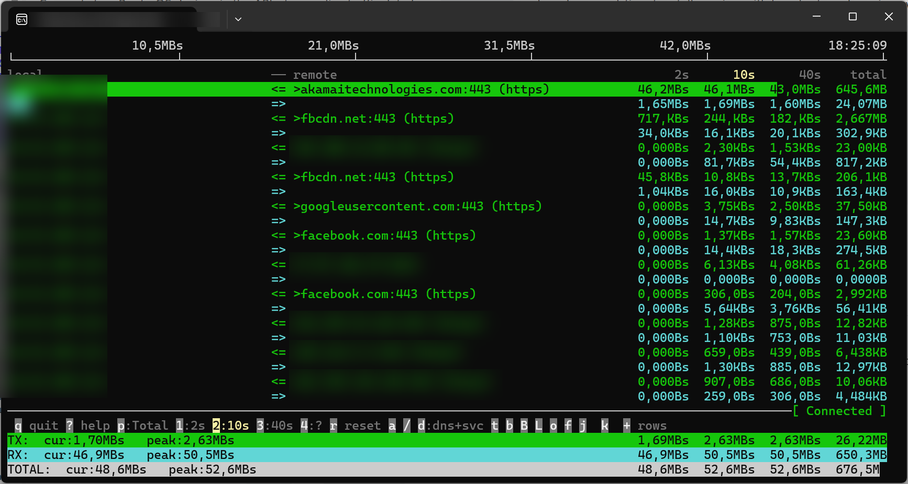

# tiktop

A console-based network traffic monitor for MikroTik routers, inspired by `iftop`.

Connects to a RouterOS device via the API, streams live traffic data from `/tool/torch`, and renders a real-time top-talkers view with bar charts and moving averages — directly in the terminal.

```
    2.0Mb          4.0Mb          6.0Mb          8.0Mb         10.0Mb
└──────────────┴──────────────┴──────────────┴──────────────┴──────────────┴
192.168.1.5   => ec2-1-2-3.eu              3.1Mb   3.0Mb   2.8Mb   5.2Gb
              <=                           512Kb   490Kb   450Kb   1.1Gb
192.168.1.12  => one.one.one.one           1.5Mb   1.4Mb   1.2Mb   3.3Gb
              <=                           210Kb   200Kb   190Kb 820.0Mb
──────────────────────────[ sort:Total | dns+svc | q p 1-3 r a / d t b B L o f j/k ± ]
TX:   cur:   4.6Mb   peak:  10.1Mb    3.1Mb   3.0Mb   2.8Mb   6.3Gb
RX:   cur: 722.0Kb   peak:   2.3Mb  722.0Kb 690.0Kb 640.0Kb   1.9Gb
TOTAL:cur:   5.3Mb   peak:  12.4Mb    3.8Mb   3.7Mb   3.4Mb   8.2Gb
```

*(Traffic level is shown as a colored background spanning the row — green for TX, cyan for RX — with inverted black text on the highlighted portion, iftop-style.)*



## Features

- **Live top-talkers view** — connections ranked by Total / TX / RX traffic, sortable by current or 2 s / 10 s / 40 s window average
- **iftop-style background bars** — traffic level shown as a colored background spanning the full row width (green TX, cyan RX); inverted black text on the colored portion. Scale ticks span the full terminal width. Footer TX / RX / TOTAL rows use the same style
- **Three moving averages** per connection: 2 s, 10 s, 40 s, plus **cumulative total since start** as a 4th column
- **Linear / logarithmic scale** — toggle with `L` for better visibility of mixed traffic sizes
- **Reverse DNS lookup** — resolves remote hostnames in the background with TTL cache; cycle between DNS+service, raw IP+port, IP+service modes
- **TX / RX display modes** — show both directions or only TX / RX (doubles visible connections)
- **Bits or bytes** — toggle between `b/Kb/Mb` and `bit/Kbit/Mbit` display
- **Freeze & pause** — freeze row order to keep stable positions; pause the entire display while data keeps accumulating
- **Host-keyed profiles** — each router is remembered by its address; profiles are loaded and updated automatically, with passwords encrypted (DPAPI on Windows, AES-GCM on Linux/macOS)
- **Auto-detect SSL / plain API** — when no explicit `--ssl`/`--no-ssl` flag is given, tries SSL (port 8729) first with a 3 s timeout, falls back to plain API (port 8728); shows a step-by-step RouterOS setup guide if neither connects
- **Dynamic layout** — adapts to terminal width and height automatically
- **Friendly error messages** — connection refused, authentication failure, SSL errors, with inline RouterOS setup guide on connection failure
- **Cross-platform** — Windows, Linux, macOS (.NET 9+)

## RouterOS setup

The router must have the API service enabled and reachable before tiktop can connect.

> **Tip:** If neither API service is enabled, tiktop prints this setup guide automatically after a failed connection attempt.

### 1. Enable API-SSL (recommended)

Generate a self-signed certificate directly on the router and attach it to the API-SSL service:

```
/certificate add name=api-ssl common-name=api-ssl \
  key-usage=digital-signature,key-encipherment days-valid=3650
/certificate sign api-ssl
/ip service set api-ssl port=8729 certificate=api-ssl disabled=no
```

tiktop accepts self-signed certificates without any additional client-side configuration.

Optionally restrict to a management subnet:

```
/ip service set api-ssl address=192.168.1.0/24
```

### 2. Enable plain API (alternative, unencrypted)

Use this only if SSL is not available (e.g. older RouterOS without certificate support):

```
/ip service set api port=8728 disabled=no
```

Connect with `tiktop --no-ssl`. Credentials are transmitted unencrypted — restrict access by subnet:

```
/ip service set api address=192.168.1.0/24
```

### Auto-detect

Without `--ssl` or `--no-ssl`, tiktop tries SSL (port 8729) first with a 3 s timeout, then falls back to plain API (port 8728). If the fallback succeeds, a warning is printed. If both fail, the relevant setup commands are shown.

### 3. Create a monitoring user (recommended)

A read-only account is sufficient — tiktop only reads traffic data:

```
/user group add name=monitor policy=read,api,!write,!reboot,!policy,!test,!password,!sniff,!sensitive,!romon
/user add name=monitor password=secret group=monitor
```

Then connect:

```bash
tiktop --host 192.168.1.1 --user monitor --pass secret
```

## Requirements

- **.NET 9** runtime (not needed for pre-built self-contained binaries)
- **MikroTik router** with RouterOS API configured (see above)
- Network reachability to the router API port (default: 8729 SSL / 8728 plain)

## Installation

### Build from source

```bash
git clone <repo>
cd tiktop/tiktop
dotnet build
dotnet run -- --host 192.168.1.1 --user admin
```

### Single-file publish

```bash
# Windows
dotnet publish tiktop/tiktop.csproj -c Release -r win-x64 -p:PublishSingleFile=true --self-contained -o publish/win

# Linux / macOS
dotnet publish tiktop/tiktop.csproj -c Release -r linux-x64 -p:PublishSingleFile=true --self-contained -o publish/linux
```

The result is a single executable with no .NET runtime dependency.

### Pre-built binaries

GitHub Actions builds `win-x64` and `linux-x64` self-contained binaries automatically on every push. Tagged releases (`v*`) publish them as GitHub Release assets — download from the **Releases** page.

## Usage

```
tiktop [<host>[:<port>]] [options]
```

All parameters are optional — missing values are resolved from saved profiles or prompted interactively.

**Connection:**

| Option | Short | Default | Description |
|--------|-------|---------|-------------|
| `<host>[:<port>]` | | prompted | Router IP/hostname as first positional arg (e.g. `192.168.1.1` or `192.168.1.1:8728`) |
| `--host <host>[:<port>]` | `-H` | prompted | Same as positional — router IP or hostname, port optional |
| `--user <name>` | `-u` | prompted | RouterOS username |
| `--pass <password>` | `-p` | prompted | RouterOS password (masked input) |
| `--interface <name>` | `-i` | picker | Interface to monitor (interactive list if omitted) |
| `--port <port>` | | 8729 / 8728 | API port override |
| `--ssl` | | auto | Force SSL connection, skip auto-detect |
| `--no-ssl` | | auto | Force plain (non-SSL) connection, skip auto-detect |
| `--count <n>` | `-n` | auto | Number of connection rows to display |
| `--dns-server <ip>` | `-d` | system DNS | Custom DNS server for reverse lookups |

Ports 8729 and 8728 are recognised as SSL / plain respectively and set the mode automatically (overridable with `--ssl` / `--no-ssl`).

**Profiles:**

| Option | Description |
|--------|-------------|
| `--profile <name>` | Load a saved profile directly (skips picker) |
| `--pick-profile` | Force profile picker even when auto-connect would fire |
| `--save-as <name>` | Save current params under a custom name after connecting |
| `--save-no-pass` | Save profile without storing the password |
| `--list-profiles` | List all saved profiles and exit |
| `--delete-profile <name>` | Delete a saved profile and exit |
| `--reset` | Delete all saved profiles and exit |
| `--no-save` / `--private` | Do not auto-save this connection |
| `--help` / `-h` / `-?` / `/?` | Show help and exit |

### Examples

```bash
# First run — prompts for host, user, password, interface; saves profile as "192.168.1.1"
tiktop

# Same, host given directly — loads existing profile for that host if saved
tiktop 192.168.1.1

# With inline port — infers plain API, loads/saves profile "192.168.1.1"
tiktop 192.168.1.1:8728

# Subsequent run for the same host — zero interactions if profile is complete
tiktop 192.168.1.1

# Switch to a different router via picker
tiktop --pick-profile

# Load a custom-named profile directly
tiktop --profile office

# Fully specified on CLI (no prompts, no profile lookup)
tiktop 192.168.1.1 -u admin -p secret -i "ether1 - WAN" --no-save

# Save under a custom name in addition to the host profile
tiktop 192.168.1.1 --save-as home-router --save-no-pass
```

## Connection profiles

Each router gets its own profile keyed by its host address. tiktop loads and updates the profile automatically — you only type parameters once.

### Startup behaviour

| Situation | Interactions |
|-----------|-------------|
| Host given on CLI, profile exists and is complete | **0** — connects immediately |
| Host given on CLI, profile incomplete or missing | Prompts only for missing fields |
| No host given, no profiles saved | Prompts host → then remaining fields |
| No host given, 1 or more profiles saved | Profile picker → **1** interaction |
| `--private` / `--no-save` | Prompts all fields, nothing saved |

### Profile picker

When multiple profiles are saved and no host is specified on the CLI:

```
Profiles:
  1) 192.168.1.1         admin  ether1 - WAN  [pass]  2026-05-20
  2) 10.0.0.1            admin  ether2                 2026-04-15
  3) <NEW>  enter a new host
Select [1]:
```

Press **Enter** to accept the most recently used profile. `[pass]` means the password is stored.

### Auto-connect (0 interactions)

When the host is given on the CLI and its profile is fully saved:

```
tiktop 192.168.1.1
```

tiktop loads the profile silently and connects without any prompts.

### Custom-named profiles

```bash
# Save under a custom name (in addition to the host profile)
tiktop 192.168.1.1 --save-as home-router

# Save without password
tiktop 192.168.1.1 --save-as home-router --save-no-pass

# Load by custom name directly
tiktop --profile home-router

# List / delete
tiktop --list-profiles
tiktop --delete-profile home-router
```

### Password security

| Platform | Method |
|----------|--------|
| Windows  | [DPAPI](https://learn.microsoft.com/en-us/dotnet/standard/security/how-to-use-data-protection) — encrypted with your Windows user account key |
| Linux / macOS | AES-GCM with machine+user derived key; config file permissions set to `600` |

Profiles are stored in:
- **Windows:** `%APPDATA%\tiktop\profiles.json`
- **Linux / macOS:** `~/.config/tiktop/profiles.json`

## Keyboard controls

| Key | Action |
|-----|--------|
| `q` / `Esc` | Quit |
| `p` | Cycle sort order: **Total → TX → RX** |
| `1` / `2` / `3` | Sort window: **instant → 2 s avg → 10 s avg → 40 s avg**; status shows `sort:Total/10s` |
| `r` | Reset all peak values |
| `a` | Cycle aggregation: **None → by-src (local IP) → by-dst (remote IP) → by-port (dst port)**; aggregated rows show `[*]` for wildcard sides; port mode shows service name (https/ssh/rdp…) in remote column |
| `d` | Cycle address/port display: **dns+svc → ip+port → ip+svc** |
| `t` | Cycle display mode: **Both → TX only → RX only** (doubles visible connections) |
| `b` | Toggle background bar highlighting on/off |
| `B` | Toggle bits / bytes (`Mb` ↔ `Mbit`) |
| `L` | Toggle linear / logarithmic scale |
| `o` | Freeze row order (positions locked, data still updates; press again to unfreeze) |
| `f` / `Space` | Pause / resume display (data keeps accumulating; press again to resume) |
| `/` | Open inline filter — type a substring of IP or hostname, `Enter` confirms, `Esc` or `/` clears; active filter shown as `/text` in status |
| `j` | Scroll down one row |
| `k` | Scroll up one row |
| `+` | Show one more row |
| `-` | Show one fewer row |

## Display layout

```
{scale labels at 20%/40%/60%/80%/100% of peak, spanning full width}
└────────┴────────┴────────┴────────┴────────┴  ← ticks from col 0 to W

{local} => {remote}   {2s avg}  {10s avg}  {40s avg}  {cumul}   ← TX row
          <=           {2s avg}  {10s avg}  {40s avg}  {cumul}   ← RX row
...
──────────────────────[ sort:Total | dns+svc | status ]
TX:    cur: {now}   peak: {peak}   {2s}  {10s}  {40s}  {cumul}
RX:    cur: {now}   peak: {peak}   {2s}  {10s}  {40s}  {cumul}
TOTAL: cur: {now}   peak: {peak}   {2s}  {10s}  {40s}  {cumul}
```

- **Background bar scale** is relative to the all-time peak total traffic. The colored background spans proportionally from the left edge of the terminal across the full row width, including the address text and statistics columns.
- **TX row** (green background) shows outgoing traffic from the local side.
- **RX row** (cyan background) shows incoming traffic to the local side.
- **Local / remote** addresses are determined by comparing against the monitored interface's subnet. If DNS is enabled, hostnames are shown once resolved (long names are intelligently shortened to keep the last two domain components).
- **Moving averages** use windows of 2 s (last 2 sections), 10 s, and 40 s.
- The **footer status badge** shows current sort mode and DNS state.
- On **disconnect**, the badge turns red with the error message; the app waits 2 s before exiting.

## Architecture

Data flows in one direction:

```
MikroTik router
    │  /tool/torch (RouterOS API, SSL)
    ▼
MikrotikWrapper          — opens connection, streams ToolTorch records
    │
    ▼
DataStack                — accumulates records by .section (≈ 1 s slots),
    │                      maintains rolling 50-section cache, tracks peaks
    ▼
DataSnapshot             — immutable snapshot: actual/peak TX+RX,
    │                      3 moving-window averages, top-N IP rows
    ▼
Visualiser               — renders to console via cursor positioning,
                           no flicker, adapts to terminal size
```

### Key components

| File | Role |
|------|------|
| `Program.cs` | Entry point, CLI parsing, keyboard loop, error handling |
| `ConnectionConfig.cs` | CLI argument parsing, interactive prompts, interface picker |
| `MikrotikWrapper.cs` | RouterOS API connection, `/tool/torch` streaming, local subnet detection |
| `Data/DataStack.cs` | Core accumulator with sort mode and peak tracking |
| `Data/DataStackSection.cs` | One time-slice of traffic data, per-connection aggregation |
| `Data/DataSnapshot.cs` | Immutable snapshot passed to the renderer |
| `Visualiser.cs` | Console renderer: bar chart, header scale, footer totals |
| `Helpers/DnsCache.cs` | Fire-and-forget async reverse DNS with TTL-based expiry |
| `Helpers/FormatHelper.cs` | Traffic formatting (b/Kb/Mb/Gb/Tb), hostname shortening |

## Dependencies

| Package | Purpose |
|---------|---------|
| [tik4net](https://github.com/danikovsky/tik4net) | RouterOS API client (project reference) |
| [DnsClient](https://github.com/MichaCo/DnsClient.NET) | Async DNS reverse lookups |

